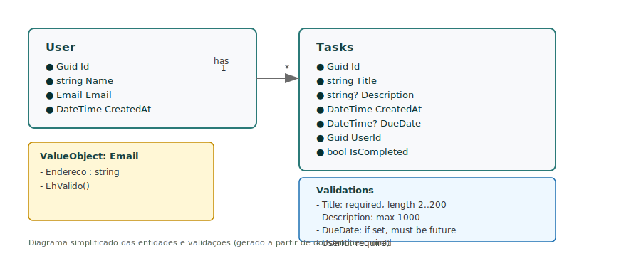

# Challenge — Gerenciamento de Tarefas

[](https://github.com/edcamargo/challenge/actions/workflows/ci.yml) [](coverage-report/index.html)

> Nota: o coverage badge (`coverage-badge.svg`) será gerado automaticamente pelo workflow de CI e um Pull Request será criado (branch `ci/coverage-badge-<run_id>`) contendo o SVG atualizado. Revise e mescle o PR para publicar o novo badge no README. Se preferir, baixe o artifact `coverage-report` do run (Actions → Artifacts), extraia o SVG e comite manualmente no repositório.

Uma API em .NET 9 para gerenciamento de tarefas (Users + Tasks) construída com princípios de Clean Architecture: Domain, Application, Infrastructure e Presentation. Projetada para ser simples, testável e de fácil manutenção.

- Linguagem: C# (.NET 9)
- Testes: xUnit + FluentAssertions + NSubstitute
- Persistência nos testes: EF Core InMemory
- CI: GitHub Actions (build/test/coverage)

---

## Sumário

- [Visão geral](#visão-geral)
- [Status / Badges](#status--badges)
- [Arquitetura & Diagramas](#arquitetura--diagramas)
- [Como rodar (rápido)](#como-rodar-rápido)
  - [Rodar local (.NET)](#rodar-local-net)
  - [Rodar com Docker](#rodar-com-docker)
- [Endpoints principais (exemplos)](#endpoints-principais-exemplos)
  - [Users](#users)
  - [Tasks](#tasks)
- [Padronização de respostas (ApiResponse)](#padronização-de-respostas-apiresponse)
- [Testes e cobertura](#testes-e-cobertura)
- [CI / Pipeline](#ci--pipeline)
- [Contribuição](#contribuição)

---

## Visão geral

A aplicação é organizada por camadas:

- Domain: Entidades, ValueObjects, validações e regras de negócio.
- Application: DTOs, Services (casos de uso), interfaces e mapeamentos.
- InfraStructure: Implementações de repositórios, DataContext (EF Core) e IoC.
- Presentation: API (controllers), middlewares, mapeamentos de resposta.

Principais decisões:
- Notification pattern (ApiResponse/ApiError) para retornar validações/erros sem lançar exceções.
- Repositório genérico + UnitOfWork para controlar persistência.
- Testes automatizados (unit + integration) com cobertura elevada.

---

## Arquitetura & Diagramas

- Diagrama da arquitetura: `docs/architecture.puml` / `docs/architecture.svg`
- Diagrama das entidades: `docs/entities.puml` / `docs/entities.svg`

(Se os SVGs não estiverem no repositório, gere com PlantUML ou use a extensão do seu editor.)

Exemplo rápido (Entities):



---

## Como rodar — rápido

Requisitos: .NET 9 SDK e (opcional) Docker.

### Rodar local (.NET)

```bash
# restaurar e compilar
dotnet restore
dotnet build -c Debug

# rodar API (Presentation.Api)
cd Presentation.Api
dotnet run --urls "http://localhost:5000"
```
Abra `http://localhost:5000/swagger/index.html` para explorar a API (development).

### Rodar com Docker

Build da imagem (a partir da raiz do repo):

```bash
docker build -f Presentation.Api/Dockerfile -t edcamargo/challenge-api:local .
```

Rodar (foreground):

```bash
docker run --rm -p 5000:5000 --name challenge-api-local edcamargo/challenge-api:local
```

Ou com docker-compose (simples):

```bash
docker-compose up --build
```

Logs:

```bash
docker logs -f challenge-api-local
```

Health check rápido (curl):

```bash
curl -v http://localhost:5000/health || curl -v http://localhost:5000/
```

> Observação: a aplicação usa EF Core InMemory para execução e testes, ou seja, *não* requer banco externo por padrão.

---

## Endpoints principais (exemplos)

Base: `http://localhost:5000/api`

### Users

- POST /api/users — criar usuário

Request (UserCreateDto):

```json
{
  "name": "Edwin",
  "email": "edwin@example.com"
}
```

Success (201):

```json
{
  "data": { "id": "<guid>", "name": "Edwin", "email": "edwin@example.com" },
  "erros": []
}
```

- GET /api/users — listar usuários (200)
- GET /api/users/{id} — buscar por id (200 / 404)
- PUT /api/users/{id} — atualizar (200 / 400 / 404)
- DELETE /api/users/{id} — remover (204 / 404)

### Tasks

- POST /api/tasks — criar tarefa

Request (TaskCreateDto):

```json
{
  "title": "Comprar leite",
  "description": "Ir ao supermercado",
  "createdAt": "2025-11-10T12:00:00Z",
  "dueDate": "2025-11-12T12:00:00Z",
  "userId": "5a3df8c0-09bc-4f3b-9484-30a61b7f8445",
  "isCompleted": false
}
```

Success (201):

```json
{
  "data": { "id": "<guid>", "title": "Comprar leite", "userId": "5a3df8c0-09bc-4f3b-9484-30a61b7f8445", "isCompleted": false },
  "erros": []
}
```

- GET /api/tasks — listar tarefas (200)
- GET /api/tasks/{id} — obter por id (200 / 404)
- GET /api/tasks/user/{userId} — tarefas de um usuário (200)
- PUT /api/tasks/{id}/complete — atualizar status/editar (200)
- DELETE /api/tasks/{id} — remover (204 / 404)

---

## Padronização de respostas (ApiResponse)

Todos os controllers retornam `ApiResponse<T>` com duas propriedades principais:

- `data`: o payload quando sucesso
- `erros`: array de `ApiError` contendo { statusCode, message, key }

Exemplo de erro (400):

```json
{
  "data": null,
  "erros": [ { "statusCode": 400, "message": "O título da tarefa é obrigatório.", "key": "title" } ]
}
```

---

## Testes e cobertura

Executar suíte de testes (local):

```bash
dotnet test ./challenge.sln --collect:"XPlat Code Coverage"
```

Gerar relatório HTML (reportgenerator):

```bash
dotnet tool install -g dotnet-reportgenerator-globaltool
reportgenerator -reports:Challenge.Test/TestResults/*/coverage.cobertura.xml -targetdir:coverage-report -reporttypes:HtmlSummary;BadgeSummary
```

O artifact `coverage-report` também é gerado pelo CI. Você pode baixar o SVG do badge (`coverage-badge.svg`) no artifact e comitá-lo no repositório para mostrar no README.

---

## CI / Pipeline

O workflow principal está em `.github/workflows/ci.yml` e executa:

1. restore
2. build
3. test (coleta de cobertura)
4. geração de relatório HTML e badge
5. upload de artifacts (coverage-report, test-results)
6. criação automática de PR com badge atualizado

> Para integração com Codecov, adicione `CODECOV_TOKEN` nas Secrets do repositório.

---

## Contribuição

1. Fork → branch `feature/...` ou `fix/...`
2. Rode os testes localmente e garanta que tudo passe
3. Abra PR com descrição clara e referências aos arquivos alterados

---

## Contatos e referências

- Diagramas: `docs/architecture.puml`, `docs/entities.puml` (SVGs: `docs/*.svg`)
- Test results & coverage: `Challenge.Test/TestResults/`

---

Se quiser, eu posso:
- gerar e commitar `docs/entities.svg` (diagrama de entidades) para o repo;
- criar docs OpenAPI (`openapi.json`) exportado via Swagger e subir como artifact no CI;
- ajustar o README para exibir a badge de cobertura automaticamente (PR automático já configurado).

---

<!-- fim do README -->
