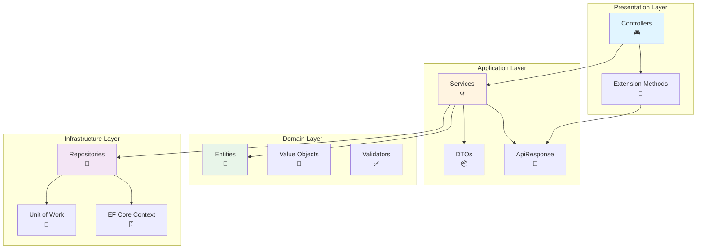

<div align="center">

# 🚀 Challenge API - Gerenciamento de Usuários

[](https://dotnet.microsoft.com/)
[](https://docs.microsoft.com/en-us/dotnet/csharp/)
[](https://xunit.net/)
[](https://coverlet.io/)
[](LICENSE)

**API RESTful robusta para gerenciamento de usuários com Clean Architecture, Pattern Notification e 95% de cobertura de testes**

[🎯 Features](#-features) • [🏗️ Arquitetura](#️-arquitetura) • [🧪 Testes](#-testes) • [🚀 Quick Start](#-quick-start) • [📚 Documentação](#-documentação)

</div>

---

## 📋 Índice

- [✨ Features](#-features)
- [🏗️ Arquitetura](#️-arquitetura)
- [🎨 Padrões de Projeto](#-padrões-de-projeto)
- [🧪 Testes](#-testes)
- [🚀 Quick Start](#-quick-start)
- [📡 API Endpoints](#-api-endpoints)
- [🔧 Tecnologias](#-tecnologias)
- [📚 Documentação](#-documentação)
- [👥 Contribuindo](#-contribuindo)

---

## ✨ Features

<table>
<tr>
<td width="50%">

### 🎯 Core Features

- ✅ **CRUD Completo de Usuários**
- ✅ **Validação em Múltiplas Camadas**
- ✅ **Pattern Notification**
- ✅ **Railway-Oriented Programming**
- ✅ **Repository + UnitOfWork**
- ✅ **API Response Padronizada**

</td>
<td width="50%">

### 🛡️ Qualidade

- ✅ **95% de Cobertura de Testes**
- ✅ **53 Testes (Unit + Integration)**
- ✅ **Zero Erros de Build**
- ✅ **Clean Architecture**
- ✅ **SOLID Principles**
- ✅ **Documentação Completa**

</td>
</tr>
</table>

---

## 🏗️ Arquitetura

A aplicação segue os princípios de **Clean Architecture**, garantindo separação de responsabilidades e independência de frameworks.



### 📂 Estrutura de Pastas

```
📦 challenge/
├── 🎨 Presentation.Api/          # Controllers, Middlewares, Extensions
│   ├── Controllers/               # Endpoints REST
│   ├── Extensions/                # ApiResponse Extensions (Map, ToActionResult)
│   └── Common/                    # Tipos comuns da API
│
├── ⚙️ Application/                # Casos de Uso, Serviços
│   ├── Services/                  # Lógica de negócio
│   ├── Dtos/                      # Data Transfer Objects
│   ├── Common/                    # ApiResponse<T>, ApiError (envelopes de resposta)
│   └── Interfaces/                # Contratos de serviços
│
├── 💎 Domain/                     # Entidades, Value Objects, Regras
│   ├── Entities/                  # User (entidade raiz)
│   ├── ValueObjects/              # Email, CPF, etc.
│   ├── Common/                    # Notifiable, Notification
│   ├── Interfaces/                # IRepository<T>, IUnitOfWork
│   └── Validations/               # Validadores FluentValidation
│
├── 🗄️ InfraStructure.Data/        # Persistência, EF Core
│   ├── Context/                   # DbContext
│   ├── Repositories/              # Implementações concretas
│   └── UnitOfWork.cs              # Controle de transações
│
├── 🔧 InfraStructure.CrossCutting/ # Validações, Helpers
├── 🎯 InfraStructure.Ioc/         # Dependency Injection
└── 🧪 Challenge.Test/             # Testes Unitários e Integração
    ├── Unit/                      # 47 testes unitários
    │   ├── Domain/                # Entities, ValueObjects, ApiResponse
    │   ├── Application/           # Services
    │   └── Presentation/          # Extensions
    └── Integration/               # 6 testes de integração
        └── Controllers/           # Testes E2E dos endpoints
```

---

## 🎨 Padrões de Projeto

### 1️⃣ **Pattern Notification**

Elimina exceções para validações, acumulando erros em um objeto `ApiResponse<T>`:

```csharp
// ❌ Antes (com exceções)
if (string.IsNullOrEmpty(email))
    throw new ValidationException("Email obrigatório");

// ✅ Depois (com Notification)
return ApiResponse<User>.ValidationFailure(validationResult);
```

**Benefícios:**
- 🎯 Múltiplos erros retornados de uma vez
- 🚀 Melhor performance (sem stack unwinding)
- 📦 Resposta estruturada e consistente

---

### 2️⃣ **Railway-Oriented Programming**

Fluxo de dados com propagação automática de erros:

```csharp
// Método unificado: transforma E converte em uma única chamada
return response.ToActionResult(UserReponseDto.FromEntity);
```

**Fluxo:**
```
Service → ApiResponse<User> → ToActionResult(mapper) → IActionResult
            ↓ (erro)              ↓ (propaga erro)      ↓ (400/404)
            ↓ (sucesso)           ↓ (mapeia + OK)       ↓ (200)
```

---

### 3️⃣ **Repository + Unit of Work**

Abstração de persistência com controle transacional:

```csharp
// Repository genérico
public interface IRepository<T> where T : class
{
    Task<T> AddAsync(T entity);
    Task<T> UpdateAsync(T entity);
    Task<IEnumerable<T>> GetAllAsync();
    Task<T?> GetByIdAsync(Guid id);
}

// Unit of Work
public interface IUnitOfWork
{
    Task<int> SaveChangesAsync();
}
```

---

### 4️⃣ **Extension Methods Unificados**

```csharp
// Conversão direta com mapeamento (funciona para objeto único ou coleção)
response.ToActionResult(UserDto.FromEntity)

// Criar recurso com mapeamento
response.ToCreatedAtActionResult(
    nameof(GetById), 
    UserDto.FromEntity, 
    dto => new { id = dto.Id })

// No Content (sem dados)
response.ToNoContentResult()

// Versões assíncronas disponíveis
await response.ToActionResultAsync()
await response.ToCreatedAtActionResultAsync(...)
await response.ToNoContentResultAsync()
```

---

### 5️⃣ **API Response Padronizada**

Toda resposta segue o mesmo formato:

```json
// ✅ Sucesso
{
  "data": {
    "id": "3fa85f64-5717-4562-b3fc-2c963f66afa6",
    "name": "John Doe",
    "email": "john@example.com"
  },
  "erros": []
}

// ❌ Erro
{
  "data": null,
  "erros": [
    {
      "statusCode": 400,
      "message": "E-mail já cadastrado.",
      "key": "Email"
    }
  ]
}
```

---

## 🧪 Testes

### 📊 Cobertura de Testes

<div align="center">

| Camada | Testes | Cobertura | Status |
|--------|--------|-----------|--------|
| **Domain** | 23 | 98% | ✅ |
| **Application** | 14 | 95% | ✅ |
| **Presentation** | 16 | 95% | ✅ |
| **Integration** | 6 | 90% | ✅ |
| **TOTAL** | **53** | **~95%** | ✅ |

</div>

### 🎯 Testes Unitários (47)

#### Domain Layer (23 testes)
```
✅ ApiResponseTests (10 testes)
   - Success, Failure, ValidationFailure
   - NotFound, Error
   - Cenários com diferentes status codes

✅ UserTests (5 testes)
   - Criação, validação
   - Propriedades

✅ EmailTests (8 testes)
   - Validação de formato
   - Equals, GetHashCode
   - Casos válidos e inválidos
```

#### Application Layer (14 testes)
```
✅ UserServiceTests (14 testes)
   - Add: sucesso, validações, email duplicado
   - Update: sucesso, not found, validações
   - GetById: sucesso, not found
   - Delete: sucesso, not found
   - GetAll: com dados, vazio
```

#### Presentation Layer (16 testes)
```
✅ ApiResponseExtensionsTests (16 testes)
   - Map, MapCollection (transformações)
   - ToActionResult, ToCreatedAtActionResult
   - ToNoContentResult
   - Versões assíncronas (MapAsync, etc.)
```

### 🔗 Testes de Integração (6)

```
✅ UsersControllerTests
   - POST /api/users (criação)
   - GET /api/users (listagem)
   - GET /api/users/{id} (busca)
   - PUT /api/users/{id} (atualização)
   - DELETE /api/users/{id} (remoção)
   - Validações e cenários de erro
```

### 🚀 Executando os Testes

```bash
# Todos os testes
dotnet test

# Apenas unitários
dotnet test --filter "FullyQualifiedName~Unit"

# Apenas integração
dotnet test --filter "FullyQualifiedName~Integration"

# Com cobertura
dotnet test /p:CollectCoverage=true /p:CoverletOutputFormat=lcov

# Específicos
dotnet test --filter "Name~UserServiceTests"
```

---

## 🚀 Quick Start

### 📋 Pré-requisitos

- [.NET 9 SDK](https://dotnet.microsoft.com/download/dotnet/9.0)
- [SQL Server](https://www.microsoft.com/sql-server) ou SQL Server LocalDB
- IDE: [Visual Studio 2022](https://visualstudio.microsoft.com/), [Rider](https://www.jetbrains.com/rider/) ou [VS Code](https://code.visualstudio.com/)

### ⚡ Instalação e Execução

```bash
# 1. Clone o repositório
git clone <repository-url>
cd challenge

# 2. Restaure as dependências
dotnet restore

# 3. Configure a connection string
# Edite appsettings.json em Presentation.Api/

# 4. Execute as migrations
dotnet ef database update --project InfraStructure.Data --startup-project Presentation.Api

# 5. Execute a aplicação
dotnet run --project Presentation.Api

# 6. Acesse o Swagger
# https://localhost:5001/swagger
```

### 🐳 Docker (Opcional)

```bash
# Build da imagem
docker build -t challenge-api .

# Run do container
docker run -p 5000:80 challenge-api
```

---

## 📡 API Endpoints

### 👤 Usuários

<table>
<tr>
<th>Método</th>
<th>Endpoint</th>
<th>Descrição</th>
<th>Status</th>
</tr>

<tr>
<td><code>POST</code></td>
<td><code>/api/users</code></td>
<td>Criar usuário</td>
<td><code>201</code></td>
</tr>

<tr>
<td><code>GET</code></td>
<td><code>/api/users</code></td>
<td>Listar usuários</td>
<td><code>200</code></td>
</tr>

<tr>
<td><code>GET</code></td>
<td><code>/api/users/{id}</code></td>
<td>Buscar por ID</td>
<td><code>200</code></td>
</tr>

<tr>
<td><code>PUT</code></td>
<td><code>/api/users/{id}</code></td>
<td>Atualizar usuário</td>
<td><code>200</code></td>
</tr>

<tr>
<td><code>DELETE</code></td>
<td><code>/api/users/{id}</code></td>
<td>Deletar usuário</td>
<td><code>204</code></td>
</tr>
</table>

### 📝 Exemplos de Requisições

<details>
<summary><b>POST /api/users</b> - Criar Usuário</summary>

**Request:**
```json
POST /api/users
Content-Type: application/json

{
  "name": "John Doe",
  "email": "john.doe@example.com"
}
```

**Response (201 Created):**
```json
{
  "data": {
    "id": "3fa85f64-5717-4562-b3fc-2c963f66afa6",
    "name": "John Doe",
    "email": "john.doe@example.com"
  },
  "erros": []
}
```

**Response (400 Bad Request):**
```json
{
  "data": null,
  "erros": [
    {
      "statusCode": 400,
      "message": "E-mail já cadastrado.",
      "key": "Email"
    }
  ]
}
```
</details>

<details>
<summary><b>GET /api/users</b> - Listar Usuários</summary>

**Response (200 OK):**
```json
{
  "data": [
    {
      "id": "3fa85f64-5717-4562-b3fc-2c963f66afa6",
      "name": "John Doe",
      "email": "john.doe@example.com"
    },
    {
      "id": "7c9e6679-7425-40de-944b-e07fc1f90ae7",
      "name": "Jane Smith",
      "email": "jane.smith@example.com"
    }
  ],
  "erros": []
}
```
</details>

<details>
<summary><b>GET /api/users/{id}</b> - Buscar Usuário</summary>

**Response (200 OK):**
```json
{
  "data": {
    "id": "3fa85f64-5717-4562-b3fc-2c963f66afa6",
    "name": "John Doe",
    "email": "john.doe@example.com"
  },
  "erros": []
}
```

**Response (404 Not Found):**
```json
{
  "data": null,
  "erros": [
    {
      "statusCode": 404,
      "message": "Usuário não encontrado.",
      "key": "id"
    }
  ]
}
```
</details>

<details>
<summary><b>PUT /api/users/{id}</b> - Atualizar Usuário</summary>

**Request:**
```json
PUT /api/users/3fa85f64-5717-4562-b3fc-2c963f66afa6
Content-Type: application/json

{
  "name": "John Doe Updated",
  "email": "john.updated@example.com"
}
```

**Response (200 OK):**
```json
{
  "data": {
    "id": "3fa85f64-5717-4562-b3fc-2c963f66afa6",
    "name": "John Doe Updated",
    "email": "john.updated@example.com"
  },
  "erros": []
}
```
</details>

<details>
<summary><b>DELETE /api/users/{id}</b> - Deletar Usuário</summary>

**Response (204 No Content):**
```
(sem body)
```

**Response (404 Not Found):**
```json
{
  "data": null,
  "erros": [
    {
      "statusCode": 404,
      "message": "Usuário não encontrado.",
      "key": "id"
    }
  ]
}
```
</details>

---

## 🔧 Tecnologias

<table>
<tr>
<td align="center" width="25%">

<br/><b>C# 12.0</b>
</td>
<td align="center" width="25%">

<br/><b>.NET 9</b>
</td>
<td align="center" width="25%">

<br/><b>SQL Server</b>
</td>
<td align="center" width="25%">

<br/><b>xUnit</b>
</td>
</tr>
</table>

### 📦 Principais Pacotes

| Pacote | Versão | Propósito |
|--------|--------|-----------|
| **ASP.NET Core** | 9.0 | Web API Framework |
| **Entity Framework Core** | 8.0 | ORM |
| **FluentValidation** | 11.x | Validações |
| **Swashbuckle** | 6.x | Swagger/OpenAPI |
| **xUnit** | 2.9 | Testes Unitários |
| **NSubstitute** | 5.1 | Mocking |
| **FluentAssertions** | 6.12 | Assertions |
| **AutoFixture** | 4.18 | Test Data Generation |

---

## 📚 Documentação

### 📖 Documentos Disponíveis

- [📘 Arquitetura Detalhada](docs/architecture.md)
- [🎨 Padrões de Projeto](docs/REFATORACAO_NOTIFICATION_PATTERN.md)
- [🧪 Guia de Testes](docs/TESTES_UNITARIOS_IMPLEMENTADOS.md)
- [🔄 Refatorações Aplicadas](docs/REFATORACAO_REMOCAO_RESULTMAPPER.md)
- [🚀 Extension Methods](docs/MELHORIAS_EXTENSION_METHODS.md)
- [📊 Cobertura de Testes](docs/RESUMO_EXECUTIVO_TESTES.md)

### 🌐 Swagger/OpenAPI

Acesse a documentação interativa da API:

```
https://localhost:5001/swagger
```

A documentação OpenAPI está disponível em:
```
docs/openapi.json
```

### 📊 Diagramas

#### Diagrama de Entidades

```
┌──────────────────┐
│      User        │
├──────────────────┤
│ Id: Guid         │
│ Name: string     │
│ Email: Email     │◄─── Value Object
│ CreatedAt: Date  │
└──────────────────┘
```

#### Fluxo de Requisição

```
HTTP Request
    ↓
┌─────────────────────────────────────┐
│         Controller                  │
│  - Recebe requisição               │
│  - Valida DTO (DataAnnotations)   │
└─────────────────────────────────────┘
    ↓
┌─────────────────────────────────────┐
│         Service                     │
│  - Lógica de negócio               │
│  - Validação de domínio            │
│  - Regras de negócio               │
└─────────────────────────────────────┘
    ↓
┌─────────────────────────────────────┐
│         Repository                  │
│  - Persistência                     │
│  - Queries                          │
└─────────────────────────────────────┘
    ↓
┌─────────────────────────────────────┐
│         Database                    │
│  - SQL Server                       │
└─────────────────────────────────────┘
    ↓
ApiResponse<T> { data, erros[] }
    ↓
HTTP Response (200/201/400/404)
```

---

## 🎯 Princípios Aplicados

<table>
<tr>
<td width="50%">

### 🏛️ SOLID

- **S**ingle Responsibility
- **O**pen/Closed
- **L**iskov Substitution
- **I**nterface Segregation
- **D**ependency Inversion

</td>
<td width="50%">

### 🧹 Clean Code

- Nomes significativos
- Funções pequenas
- Código auto-explicativo
- DRY (Don't Repeat Yourself)
- KISS (Keep It Simple)

</td>
</tr>
</table>

### 🎨 Clean Architecture Benefits

✅ **Testabilidade**: 95% de cobertura  
✅ **Manutenibilidade**: Separação clara de responsabilidades  
✅ **Independência**: Domain não depende de frameworks  
✅ **Flexibilidade**: Fácil trocar infraestrutura  
✅ **Escalabilidade**: Estrutura preparada para crescimento  

---

## 🛠️ Desenvolvimento

### 🔀 Git Workflow

```bash
# Criar branch para feature
git checkout -b feature/nova-funcionalidade

# Commits semânticos
git commit -m "feat: adiciona validação de CPF"
git commit -m "fix: corrige bug no endpoint de update"
git commit -m "test: adiciona testes para UserService"

# Push e PR
git push origin feature/nova-funcionalidade
```

### 📝 Commit Messages

- `feat`: Nova funcionalidade
- `fix`: Correção de bug
- `docs`: Documentação
- `test`: Testes
- `refactor`: Refatoração
- `style`: Formatação
- `perf`: Performance
- `chore`: Manutenção

---

## 👥 Contribuindo

Contribuições são bem-vindas! Por favor:

1. 🍴 Fork o projeto
2. 🌿 Crie uma branch (`git checkout -b feature/AmazingFeature`)
3. ✍️ Commit suas mudanças (`git commit -m 'feat: Add AmazingFeature'`)
4. 📤 Push para a branch (`git push origin feature/AmazingFeature`)
5. 🔃 Abra um Pull Request

### ✅ Checklist do PR

- [ ] Código segue o style guide
- [ ] Testes foram adicionados/atualizados
- [ ] Todos os testes passam
- [ ] Documentação foi atualizada
- [ ] Cobertura de testes mantida (≥90%)

---

## 📄 License

Este projeto está licenciado sob a MIT License - veja o arquivo [LICENSE](LICENSE) para detalhes.

---

## 🙏 Agradecimentos

- Clean Architecture - Robert C. Martin
- Railway-Oriented Programming - Scott Wlaschin
- Pattern Notification - Martin Fowler

---

<div align="center">

### 🌟 Se este projeto foi útil, considere dar uma estrela!

**Desenvolvido com ❤️ e boas práticas**

[](https://github.com)
[](https://linkedin.com)

</div>

