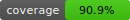
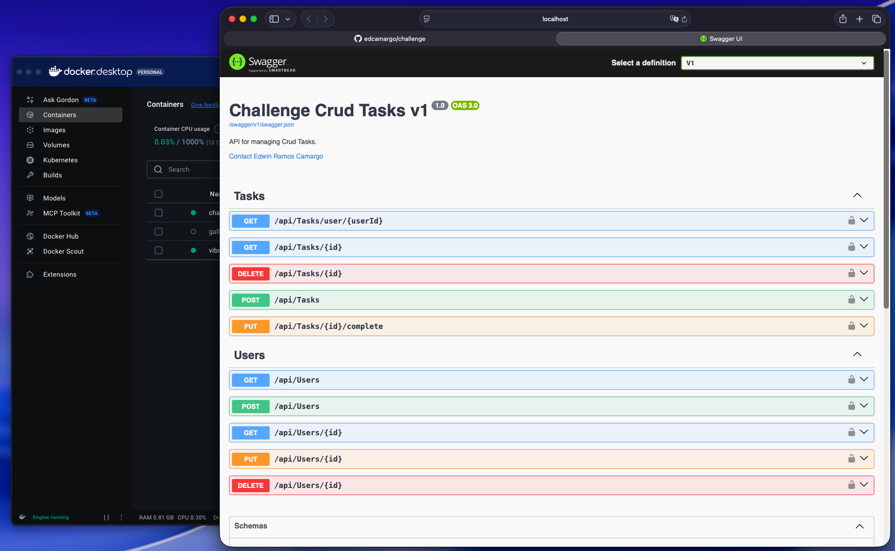

<!-- Badge de cobertura local -->


# Challenge — Gerenciamento de Tarefas

<p align="center">
  
  
</p>

---

Uma API .NET 9 compacta e bem testada para gerenciamento de Usuários e Tarefas — construída com separação clara entre as camadas Domain, Application e Presentation. Ideal para avaliações técnicas, backend inicial ou referência para padrões de arquitetura limpa.

> TL;DR: base de código pequena e legível com testes sólidos, envelope de API consistente (data + erros) e diagramas de arquitetura claros.

---

## Por que um tech lead vai gostar

- ✅ Separação clara de responsabilidades (Domain / Application / Infra / Presentation)
- ✅ Padrão Notification / ApiResponse para contratos consistentes com clientes
- ✅ Alta cobertura de testes e testes de integração automatizados (InMemory)
- ✅ Superfície pequena para revisão — fácil de entender e estender

---

## Links rápidos

- Arquitetura: `docs/architecture.svg`
- Entidades: `docs/entities.svg`
- Executar localmente: Presentation.Api (dotnet run)
- Docker: build & run (veja Início Rápido)

<!-- Título e descrição para a imagem do Swagger -->
### Documentação interativa (Swagger UI)
<p align="center">
  <em>Explore os endpoints, modelos e exemplos interativos da API diretamente pelo Swagger UI.</em>
</p>
<p align="center" style="margin-top:320px;">
  
</p>

## Início Rápido

Requisitos: .NET 9 SDK (dev) ou Docker (container).

Executar localmente (desenvolvimento):

```bash
# da raiz do repositório
dotnet restore
dotnet build -c Debug
cd Presentation.Api
dotnet run --urls "http://localhost:5000"
```

Abrir: http://localhost:5000/swagger/index.html

Executar com Docker (build + run):

```bash
docker build -t challenge:latest .

docker run -d -p 8080:8080 --name challenge challenge:latest
```

Dicas:

```bash
# logs
docker logs -f challenge
# parar + remover
docker stop challenge && docker rm challenge
```

---

## Destaques para Tech Lead (resumo)

- Arquitetura: em camadas, DI na raiz de composição (`InfraStructure.Ioc`).
- Domain: Entidades + ValueObjects com validação interna.
- Application: Services implementam regras de negócio e retornam `ApiResponse<T>` (resultados de operação + notificações).
- Presentation: controllers mínimos que mapeiam para services e retornam respostas envelopadas.

Se você for revisar este repositório, verifique rapidamente:

1. Entidades e validações de domínio (Domain/**)
2. Services da aplicação (Application/**) — onde vivem as regras de negócio
3. Controllers (Presentation.Api/Controllers) — devem ser enxutos
4. Testes (Challenge.Test) — cobertura unit + integration e exemplos

---

## Arquitetura (visual)


---

## Contrato da API — Padrão envelope

Todos os endpoints retornam o mesmo envelope JSON:

```json
{
  "data": /* payload de sucesso ou null */, 
  "erros": [ /* zero ou mais objetos ApiError */ ]
}
```

Formato de `ApiError`:

```json
{ "statusCode": 400, "message": "Mensagem amigável", "key": "Campo" }
```

### Por que adotar este padrão

- Respostas previsíveis para os clientes.
- Tratamento de erros uniforme e simples de traduzir para a UI.
- Um único ponto para mapear resultados de validação em erros estruturados.

---

## Exemplos de requisições e respostas

Criar usuário (POST /api/users)

Requisição:

```bash
curl -X POST http://localhost:5000/api/users \
  -H 'Content-Type: application/json' \
  -d '{"name":"Edwin","email":"edwin@example.com"}'
```

Sucesso (201):

```json
{
  "data": { "id": "<guid>", "name":"Edwin", "email":"edwin@example.com" },
  "erros": []
}
```

Erro de validação (400):

```json
{
  "data": null,
  "erros": [ { "statusCode": 400, "message": "E-mail inválido", "key": "email" } ]
}
```

Criar tarefa (POST /api/tasks) — payload conforme `TaskCreateDto`; a resposta segue o mesmo envelope.

Listar tarefas por usuário (GET /api/tasks/user/{userId}) — exemplo de retorno:

Sucesso (200):

```json
{
  "data": [
    {
      "id": "11111111-1111-1111-1111-111111111111",
      "title": "Comprar leite",
      "description": "Ir ao mercado",
      "createdAt": "2025-11-01T12:00:00Z",
      "dueDate": "2025-11-02T12:00:00Z",
      "userId": "22222222-2222-2222-2222-222222222222",
      "user": { "id": "22222222-2222-2222-2222-222222222222", "name": "Owner", "email": "owner@example.com" },
      "isCompleted": false
    }
  ],
  "erros": []
}
```

Erro (400 ou 404):

```json
{
  "data": null,
  "erros": [ { "statusCode": 404, "message": "Usuário não encontrado", "key": "userId" } ]
}
```

---

## Testes e Cobertura

Executar testes localmente:

```bash
dotnet test ./challenge.sln --collect:"XPlat Code Coverage"
```

Gerar relatório de cobertura legível (local):

```bash
# instalar uma vez
dotnet tool install -g dotnet-reportgenerator-globaltool
# gerar relatório
reportgenerator -reports:Challenge.Test/TestResults/*/coverage.cobertura.xml -targetdir:coverage-report -reporttypes "HtmlSummary;BadgeSummary"
open coverage-report/summary.html
```

**Métricas (última execução):**

- 📊 Coverage (linhas): **90.94%** — 633/696
- 🔀 Coverage (branches): **72.54%** — 74/102

---

## Contribuindo

1. Faça fork do repositório, crie branch `feature/...` ou `fix/...`
2. Execute a suíte de testes e adicione testes para novos comportamentos
3. Abra um PR com descrição e contexto

---

<!-- EOF -->
